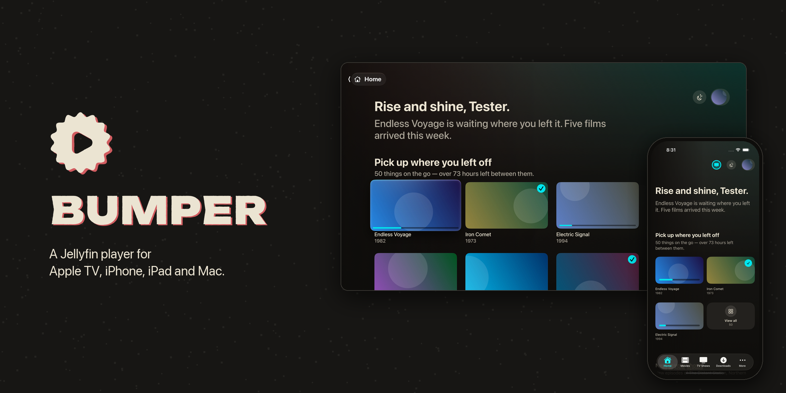

<p align="center"></p>

# Bumper

Bumper is a [Jellyfin](https://jellyfin.org) player for Apple TV, iPhone, iPad and Mac. It is one
SwiftUI app, built from one shared package, and it plays files directly: Apple's player for what
it can open, VLCKit for everything else, so the server rarely has to transcode.

It is free and open source. The only purchase is an optional themes unlock.

## What it does

- **Plays your library as it is.** MKV, AVI and TS; HEVC, HDR10, AV1, MPEG-2 and VC-1; DTS,
  TrueHD and E-AC-3; ASS, SSA and PGS subtitles. AVPlayer handles MP4 with H.264 or HEVC and AAC
  or Dolby audio (Picture in Picture, AirPlay, Dolby Vision); VLCKit handles the rest.
- **Home and libraries as collections.** Rows with a line of copy each, the next episode of what
  you're watching, and a View all page for every row that you can narrow by genre, decade, rating,
  length or when it was added.
- **Search in plain words.** "Something funny from the 80s under 90 minutes" becomes filters on
  your library.
- **Subtitles found for the file.** Your server's subtitle plugin (OpenSubtitles) searches; the
  results are ranked for the file you're watching; the pick is saved on the server.
- **Downloads** on iPhone, iPad and Mac. The original file in parallel byte ranges, or a smaller
  copy the server converts first. Downloaded items play from the device, and progress made offline
  is sent to the server later.
- **Queue.** Line up what to watch and when it should end; it syncs between your devices through
  the server.
- **Background Noise.** A show plays on a loop from a random episode without marking anything
  watched.
- **Audiobooks.** Chapters, speed with pitch kept, and Smart Speed, which shortens silences.
- **On the TV:** the Top Shelf (continue watching, recently added, your libraries), frame-rate and
  dynamic-range matching, and a sleep timer.
- **On the iPhone and iPad:** a TV button that connects to Bumper on your Apple TV to see what's on
  it, queue things and play them there.
- **Sign-in** with a password or Quick Connect, and any number of servers and users.

## Requirements

- tvOS 26, iOS 26, iPadOS 26 or macOS 26
- Jellyfin 10.11
- Xcode 26 and [XcodeGen](https://github.com/yonaskolb/XcodeGen) to build

tvOS 26 is the floor so the Apple TV 4K (2017) is supported; tvOS 27 APIs are used where available.

## Building

```bash
brew install xcodegen
scripts/fetch-vlckit.sh   # VideoLAN's VLCKit 4 xcframework into Vendor/ (checksum-pinned)
xcodegen generate         # writes Bumper.xcodeproj
open Bumper.xcodeproj
```

The schemes are `Bumper` (Apple TV), `BumperPhone` (iPhone and iPad) and `BumperMac`.

Launch with `-mock` to use the built-in fake server: 600 films, 48 shows and generated artwork,
no Jellyfin needed. Other launch arguments: `-reset`, `-perfHUD`, `-mockHTTP` (a real loopback
server), `-mockMedia <dir>` (serve real clips), `-route <item:|library:|grid:|settings:|downloads>`.

## How playback is chosen

[`PlaybackPlanner`](Packages/JellyfinAppKit/Sources/PlaybackCore/PlaybackPlanner.swift) decides per
item, from the media information the server already returned:

| Backend | When |
|---|---|
| AVPlayer | MP4, M4V or MOV (or the server's HLS); H.264 or HEVC; AAC, AC-3 or E-AC-3; no subtitles, or WebVTT |
| VLCKit | Everything else |
| Server transcode, then AVPlayer | Over a bitrate cap, Dolby Vision profile 5 outside MP4, or video the device can't decode in real time |

Choosing a subtitle or audio track AVPlayer can't play hands the item to VLCKit at the same
position, and so does an AVPlayer error. Downloaded files follow the same rules.

## Measured on an Apple TV 4K (2017)

| | |
|---|---|
| Home and library scrolling | 16.7 ms per frame at p50 and p95 (60 fps) |
| Press Play to picture, VLCKit (MKV, TS) | 110–280 ms when Play had focus first; 150–570 ms cold |
| Press Play to picture, AVPlayer (MP4) | 460–530 ms |
| ±10 s skip | 0.3 s (VLCKit), 0.5 s (AVPlayer) |
| Resume 15 minutes into a 1 GB MKV | 0.8–1.0 s |

On a Mac on a home network, a 1.05 GB original downloads in 13–15 seconds.

## Tests

```bash
scripts/test.sh                  # core logic on macOS, in seconds
scripts/test.sh smoke            # TV UI checks against the mock server
scripts/test.sh sidebar|settings|profile|player
scripts/test.sh device           # playback and seeking on a real Apple TV
scripts/device-scroll-check.sh   # frame timing while scrolling, on a real Apple TV
scripts/phone-scroll-check.sh    # the same on a real iPhone
scripts/companion-check.sh       # the iPhone's TV button against the TV app, both in simulators
```

UI tests run against the mock server; nothing signs in to a real Jellyfin.
`scripts/make-test-media.sh` generates the clips the playback tests use.

## Layout

```
App/                 Apple TV app (entry point, assets, StoreKit configuration)
iPhone/              iPhone and iPad app (and the TV button's companion)
Mac/                 Mac app
TopShelfExtension/   the Apple TV Top Shelf
Packages/JellyfinAppKit/
  JellyfinAPI/       a Jellyfin 10.11 client
  AppCore/           accounts, settings, downloads, image pipeline, caches, copy
  PlaybackCore/      the player interface, planning, AVPlayer, subtitles, progress reports
  VLCPlayback/       the VLCKit backend
  DesignSystem/      themes, cards, layout and platform helpers
  AppFeatures/       the screens
  JellyfinMocks/     the mock server for tests, previews and -mock
services/search/     the search and subtitle-ranking service (Cloudflare Worker)
scripts/             builds, tests, benchmarks, test media, release
```

## Search service

[`services/search`](services/search) is a Cloudflare Worker that turns search words into library
filters and ranks subtitle candidates. Answers are cached. If it's off or unreachable, the app
reads searches and ranks subtitles on the device instead. See its
[README](services/search/README.md).

## License

[MIT](LICENSE). VLCKit is VideoLAN's, under the LGPL 2.1, fetched by
[`scripts/fetch-vlckit.sh`](scripts/fetch-vlckit.sh).
